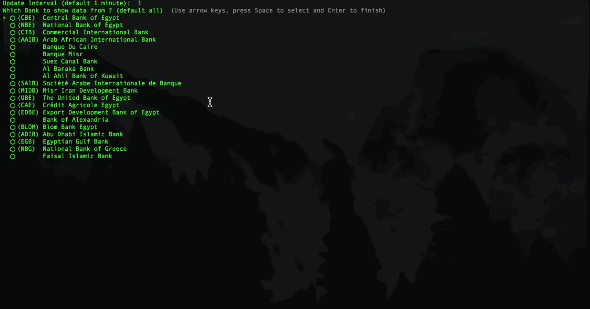

# EGPRatesCLI

CLI for showing and updating EGP exchange rate on terminal screen (every X interval)

Built using [EGP-Rates](https://github.com/mad-raz/EGP-Rates)

## Installation

    $ gem install EGP_Rates_CLI

## Usage

    $ egp

## Development

Feel free to fork, update, change or fix.

## Contributing

Bug reports and pull requests are welcome on GitHub at https://github.com/mad-raz/EGP_Rates_CLI. This project is intended to be a safe, welcoming space for collaboration, and contributors are expected to adhere to the [Contributor Covenant](http://contributor-covenant.org) code of conduct.

## License

The gem is available as open source under the terms of the [MIT License](http://opensource.org/licenses/MIT).
